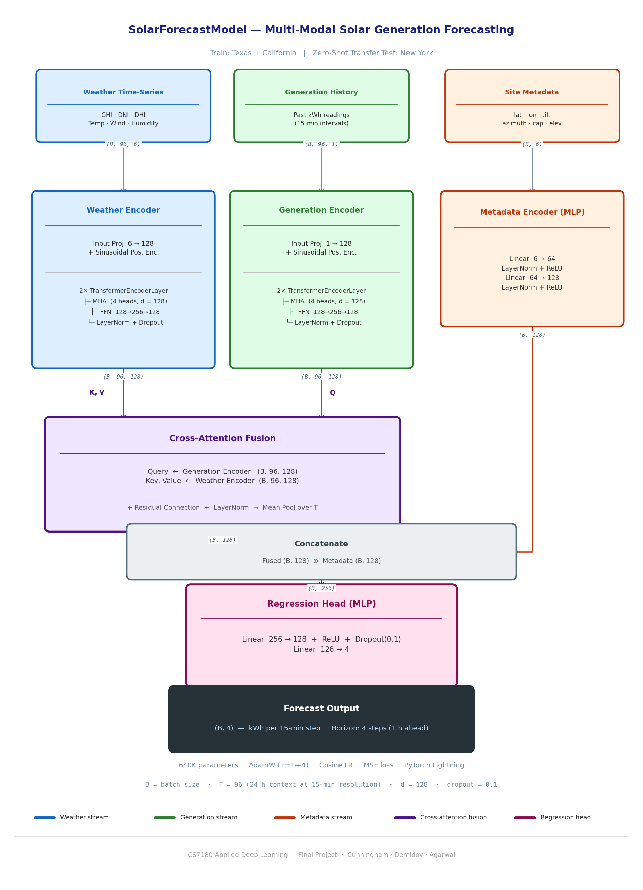

# CS7180 Final Project — Multi-Modal Solar Generation Forecasting

**CS7180: Applied Deep Learning**
**Team:** Nathan Cunningham · Nikita Demidov · Chaitanya Agarwal

---

## Overview

We train a multi-modal Transformer model to forecast residential solar generation
(kWh per 15-minute interval, 1-hour horizon) from three input streams: real-time
weather observations, historical generation, and static site metadata.

The core research question is **geographic transfer**: train on Texas and California
sites, then evaluate zero-shot on New York sites — testing whether the model learns
weather-to-generation mappings that generalise across climates without fine-tuning.

---

## Model Architecture



### Component Descriptions

| Component | File | Description |
|-----------|------|-------------|
| **WeatherEncoder** | `src/models/encoders/weather.py` | Transformer encoder (2 layers, 4-head MHA, d=128) that processes a 96-step sequence of GHI, DNI, DHI, temperature, wind speed, and relative humidity. A learnable linear projection maps the 6 raw features to d=128, followed by sinusoidal positional encoding. |
| **GenerationEncoder** | `src/models/encoders/generation.py` | Identical Transformer architecture operating on the univariate past-kWh series. Shares the same d=128 / 4-head / 2-layer configuration, keeping the two latent spaces compatible for cross-attention. |
| **MetadataEncoder** | `src/models/encoders/metadata.py` | Two-layer MLP (6→64→128) with LayerNorm and ReLU that embeds time-invariant site features — latitude, longitude, panel tilt, azimuth, system capacity, and elevation — into the same d=128 space. |
| **CrossAttentionFusion** | `src/models/fusion/cross_attention.py` | `nn.MultiheadAttention` (4 heads) with the **generation sequence as Query** and the **weather sequence as Key/Value**. A residual connection and LayerNorm are applied before mean-pooling over the sequence dimension to produce a single (B, 128) vector. |
| **Concatenate** | `src/models/__init__.py` | The pooled fusion vector (B, 128) is concatenated with the metadata embedding (B, 128), yielding a (B, 256) representation that combines dynamic weather-generation context with static site properties. |
| **RegressionHead** | `src/models/heads/regression.py` | Two-layer MLP (256→128→4) with ReLU and dropout that maps the fused representation to 4 predicted kWh values, one per 15-minute interval in the forecast horizon (1 hour total). |

### Input Data Streams

| Stream | Shape | Source | Features |
|--------|-------|--------|----------|
| **Weather time-series** | (B, 96, 6) | NSRDB GOES CONUS v4 | GHI, DNI, DHI, air temperature, wind speed, relative humidity |
| **Generation history** | (B, 96, 1) | Pecan Street Dataport | Past solar generation (kWh, 15-min intervals) |
| **Site metadata** | (B, 6) | Pecan Street + PVDAQ | Latitude, longitude, panel tilt, azimuth, system capacity (kW), elevation (m) |

Context window: **96 steps = 24 hours** at 15-minute resolution.
Forecast horizon: **4 steps = 1 hour** ahead.

### Key Hyperparameters (`configs/experiment.yaml`)

| Parameter | Value |
|-----------|-------|
| `d_model` | 128 |
| `nhead` | 4 |
| `num_layers` | 2 |
| `ffn_dim` | 256 |
| `dropout` | 0.1 |
| `seq_len` | 96 |
| `forecast_horizon` | 4 |
| Total parameters | ~640K |

---

## Transfer Learning Evaluation Strategy

The model is trained exclusively on **Texas (Austin)** and **California (San Jose)**
residential PV sites from the Pecan Street dataset. New York sites are held out
entirely during training and used only for final evaluation.

**Rationale:** Austin and California represent sunny, dry climates with high and
consistent irradiance. New York has a cloudier, more variable continental climate.
If the model generalises — without any New York examples — it suggests the
cross-attention mechanism learns transferable weather-to-generation physics rather
than site-specific patterns.

**Evaluation metrics:** MAE (kWh), RMSE (kWh), and skill score relative to a
persistence baseline (predict next hour = current hour).

| Split | Sites | Region |
|-------|-------|--------|
| Train (70%) | Austin + California homes | Texas, California |
| Validation (15%) | Austin + California homes | Texas, California |
| **Test (zero-shot)** | **New York homes** | **New York** |

---

## Results

### Final Results — All 14 Experiments

**V1:** trained on 19 TX homes + 1 real CA home (20 homes total).
**V2:** trained on 19 TX homes + 1 real CA home + 18 synthetic San Diego homes (38 homes total).
All NY fine-tuning experiments use the V1 checkpoint (M1) or V2 checkpoint (M2) as the base. Delta = V2 MAE − V1 MAE; negative = V2 better.

| Experiment | V1 MAE (kWh) | V2 MAE (kWh) | Delta |
|---|---|---|---|
| zero_shot (NY) | 0.1657 | 0.1714 | +0.0057 |
| finetune_7d (NY) | 0.1495 | 0.1609 | +0.0114 |
| finetune_30d (NY) | 0.1325 | 0.1489 | +0.0164 |
| finetune_90d (NY) | 0.1046 | 0.1089 | +0.0043 |
| finetune_180d (NY) | 0.0550 | 0.0582 | +0.0032 |
| in_region_tx | 0.0356 | 0.0352 | −0.0004 |
| in_region_ca | 0.0173 | **0.0151** | **−0.0022** |

Raw data: [`results/all_results.csv`](results/all_results.csv)

### Result Plots

| Plot | Description |
|---|---|
| [Data Efficiency Curve](results/plots/data_efficiency_curve.png) | NY MAE vs. fine-tuning days for V1 and V2 |
| [Generalization Gap](results/plots/generalization_gap.png) | Gap between in-region and zero-shot MAE across models |
| [Metric Comparison](results/plots/metric_comparison.png) | MAE, RMSE, and skill score side-by-side across all experiments |
| [Skill Score Curve](results/plots/skill_score_curve.png) | Skill score vs. fine-tuning days relative to persistence baseline |

---

## Key Findings

**1. Synthetic data works for the task it was designed for.**
V2 achieves 12.8% lower MAE on in-region California evaluation (0.0151 vs. 0.0173 kWh). The 18 synthetic San Diego homes generated via pvlib PVWatts — parameterised from LBNL Tracking the Sun distributions and calibrated against real home 9836 — provide a meaningful training signal for CA-climate generation patterns.

**2. Synthetic CA data slightly hurts NY transfer.**
V2 underperforms V1 on NY zero-shot and across all fine-tuning windows by 3–12%. The most likely explanation is climate-regime conflict: San Diego has an arid Mediterranean climate with high, stable irradiance, which is systematically different from New York's humid continental climate. Adding San Diego-like patterns may shift encoder representations in a direction that reduces NY zero-shot accuracy. This finding is discussed further in [docs/FUTURE_WORK.md](docs/FUTURE_WORK.md).

**3. Sufficient fine-tuning data overcomes the synthetic disadvantage.**
At 180 days of NY fine-tuning, V1 and V2 converge to similar performance — V1 closes 66.8% of the zero-shot gap, V2 closes 66.1%. The small remaining gap (0.003 kWh MAE) suggests that real target-region data dominates the training signal once enough of it is available.

**4. Data efficiency shows strong diminishing returns.**
Fine-tuning on NY data closes the generalization gap rapidly at first and then plateaus:
- 7 days → ~10% of gap closed
- 30 days → ~20% of gap closed
- 90 days → ~37% of gap closed
- 180 days → ~67% of gap closed

This pattern is consistent across both V1 and V2, suggesting it reflects a property of the model and task rather than the training data composition.

**5. TX generalization is unaffected by synthetic CA augmentation.**
In-region TX MAE is nearly identical between V1 (0.0356) and V2 (0.0352). Augmenting the CA portion of training data does not degrade performance on TX, confirming that the two regional signals are largely separable within the multi-modal encoder.

---

## Limitations

Reported MAPE values (600–1300%) are inflated by near-zero nighttime solar readings and should not be interpreted as meaningful. All metrics are single-seed point estimates; no variance estimates are available. The California training set relies on one real Pecan Street home and 18 physics-based synthetic homes due to limited Dataport exports.

For a full discussion of infrastructure, evaluation, data, and modelling limitations — and proposed remedies — see [docs/FUTURE_WORK.md](docs/FUTURE_WORK.md).

---

## Documentation

| Document | Description |
|---|---|
| [docs/SYNTHETIC_METHODOLOGY.md](docs/SYNTHETIC_METHODOLOGY.md) | Scientific basis and implementation details for synthetic CA data generation |
| [docs/FUTURE_WORK.md](docs/FUTURE_WORK.md) | Limitations and future directions (infrastructure, evaluation, data, model) |
| [results/all_results.csv](results/all_results.csv) | All 14 experiment results (MAE, RMSE, R², skill score, checkpoint paths) |

---

## Getting Started

### Prerequisites

- [conda](https://docs.conda.io/en/latest/miniconda.html) (Miniconda or Anaconda)
- git
- AWS credentials — shared privately by Nathan

### 1. Clone and install

```bash
git clone https://github.com/Chaim3ra/CS7180_final
cd CS7180_final
conda create -n CS7180 python=3.11
conda activate CS7180
pip install -r requirements.txt
```

### 2. Configure AWS credentials (run once)

Copy `.env.example` to `.env` and fill in your AWS credentials:

```bash
cp .env.example .env
# Edit .env and set AWS_ACCESS_KEY_ID and AWS_SECRET_ACCESS_KEY
```

All data streams directly from S3 — no `dvc pull` or local data download required.

### 3. Validate setup

```bash
python src/validate.py
```

### 4. Run training

```bash
python src/train.py
```

---

## Repository Structure

```
CS7180_final/
├── configs/
│   ├── experiment.yaml         # V1 hyperparameters and Trainer config
│   └── experiment_v2.yaml      # V2 config (synthetic CA, same architecture)
├── data/
│   ├── raw/                    # Raw CSVs — streamed from S3, not committed to git
│   └── processed/              # Processed parquets — streamed from S3, not committed to git
├── docs/
│   ├── model_architecture.png  # Architecture diagram
│   ├── SYNTHETIC_METHODOLOGY.md
│   └── FUTURE_WORK.md
├── results/
│   ├── all_results.csv         # All 14 experiment results
│   ├── all_results.md          # Human-readable results summary
│   ├── per_home_metrics.csv    # Per-home breakdown for NY evaluation
│   └── plots/                  # data_efficiency_curve, generalization_gap,
│                               # metric_comparison, skill_score_curve (PNG + CSV)
├── src/
│   ├── dataloader.py           # Polars-backed SolarWindowDataset + LightningDataModule
│   ├── train.py                # Training entry point
│   ├── finetune.py             # NY fine-tuning with frozen encoders
│   ├── evaluate.py             # Standalone evaluation script
│   ├── preprocess.py           # Raw → processed parquet pipeline (+ synthetic CA merge)
│   ├── synthetic.py            # Synthetic San Diego CA solar generation (pvlib)
│   ├── metrics.py              # MAE, RMSE, R², skill score, per-home metrics
│   ├── results_utils.py        # CSV results persistence
│   ├── plot_results.py         # Generate results/plots/
│   ├── validate.py             # Setup validation script
│   ├── fetch_pecanstreet.py    # Pecan Street Dataport fetch script
│   ├── fetch_nsrdb.py          # NREL NSRDB fetch script
│   ├── fetch_nasa_power.py     # NASA POWER fetch script
│   ├── fetch_pvdaq.py          # DOE PVDAQ S3 metadata + candidate selection
│   └── models/
│       ├── __init__.py         # SolarForecastModel (LightningModule) + build()
│       ├── base.py             # Abstract base classes
│       ├── encoders/
│       │   ├── weather.py      # Transformer encoder for weather
│       │   ├── generation.py   # Transformer encoder for generation history
│       │   └── metadata.py     # MLP encoder for static site features
│       ├── fusion/
│       │   └── cross_attention.py   # Cross-attention + mean pool
│       └── heads/
│           └── regression.py   # MLP regression head
└── requirements.txt
```

---

## Quick Start

```python
from src.models import build

model = build("configs/experiment.yaml")
print(model)  # full architecture summary
```
